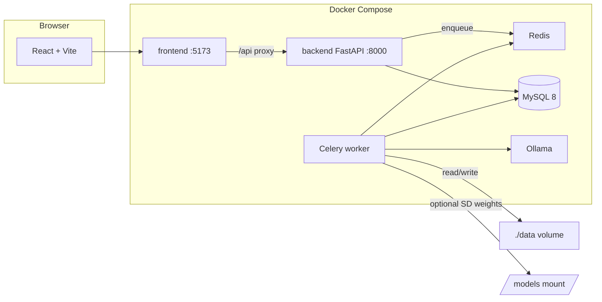
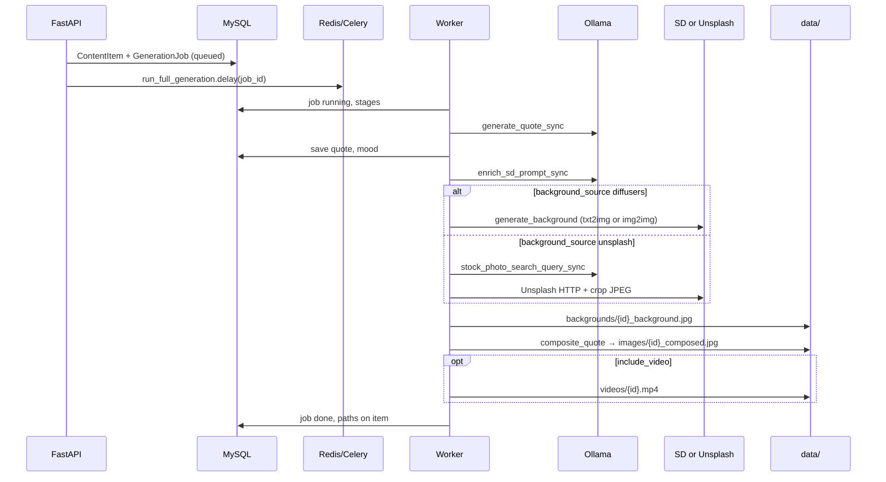

# ContentForge

ContentForge is a full-stack application for **topic-driven social content**: it generates **quotes** (via a local LLM), **vertical images** (Stable Diffusion or Unsplash), **composites** quote text onto the image, optionally **renders a short video** (Ken Burns–style), and can **post** to configured platforms through a plugin layer.

This README is written for **full-stack developers** who need to run, extend, or debug the system—especially the **async generation pipeline** (API → DB → Celery → files on disk).

---

## Architecture



| Service | Role |
|--------|------|
| **frontend** | React SPA; Vite dev server proxies `/api` and `/health` to the backend (in Compose: `http://backend:8000`). |
| **backend** | FastAPI: CRUD, settings, generation triggers, static file routes for content images/videos. **Does not** run heavy image generation. |
| **worker** | Same Python image as backend; runs **Celery** with `concurrency=1` so only one generation task loads SD/RAM at a time. |
| **redis** | Celery broker and result backend; also **Redis pub/sub** so the API can broadcast generation events to browsers over WebSockets. |
| **db** | MySQL: topics, content items, generation jobs, app settings, platform accounts, post history. |
| **ollama** | Local LLM HTTP API (`/api/generate`) for quotes, SD prompt enrichment, stock-photo search phrases, and social captions. |

---

## Tech stack

- **Backend:** Python 3.11, FastAPI, SQLAlchemy 2, Alembic, Celery 5, httpx, Pillow, diffusers/torch (in worker), MoviePy (video).
- **Frontend:** React, React Router, Vite, Tailwind-style utility classes (`cf-*`), axios.
- **Infra:** Docker Compose; optional `docker-compose.gpu.yml` for NVIDIA hosts; Redis pub/sub for live UI updates.

---

## Repository layout

| Path | Purpose |
|------|---------|
| `contentforge/` | Backend + worker code (single package: `main.py`, `api/`, `models/`, `tasks/`, `services/`, `alembic/`). |
| `frontend/` | Vite + React UI. |
| `docker-compose.yml` | Default stack (CPU-friendly SD; Ollama CPU). |
| `docker-compose.gpu.yml` | Optional overlay for GPU (Linux + NVIDIA). |
| `data/` | Runtime user data (mounted to `/app/data` in containers): `images/`, `backgrounds/`, `videos/`, `topic_refs/`. |
| `models/sd15/` | Optional host mount for Stable Diffusion 1.5 diffusers weights (read-only in worker). |
| `.env` | Secrets and URLs (not committed). See `.env.example`. |

---

## Quick start (Docker)

1. **Copy environment file**

   ```bash
   cp .env.example .env
   ```

   Edit MySQL passwords, `SECRET_KEY`, and any optional keys (e.g. `UNSPLASH_ACCESS_KEY`).

2. **Stable Diffusion weights (optional, for topics that use Stable Diffusion backgrounds)**

   The worker expects a **diffusers** layout at the path stored in **Settings → Diffusers model path** (default in DB is often `/models/stable-diffusion`). The compose file mounts `./models/sd15` at `/models/sd15`; point Settings to that path or adjust the mount.

3. **Pull an Ollama model** (e.g. on first run)

   ```bash
   docker compose exec ollama ollama pull llama3.2
   ```

   In **Settings**, pick the model by name (the UI lists installed models from Ollama’s **`/api/tags`**; pull new ones with `ollama pull …` then refresh).

4. **Start stack**

   ```bash
   docker compose up -d --build
   ```

5. **Run migrations** (idempotent)

   ```bash
   docker compose exec backend alembic upgrade head
   ```

6. **Open the app**

   - UI: `http://localhost:5173`
   - API: `http://localhost:8000`
   - Health: `http://localhost:8000/health`

---

## Environment variables

Loaded from `.env` into **backend** and **worker** (`env_file` in Compose). Names map to `contentforge/config.py` (`pydantic-settings`).

| Variable | Purpose |
|----------|---------|
| `DATABASE_URL` | SQLAlchemy URL (MySQL in Docker: host `db`). |
| `SECRET_KEY` | App secret (e.g. credential encryption helpers). |
| `DATA_DIR` | Filesystem root for media; default `/app/data` in containers. |
| `OLLAMA_BASE_URL` | e.g. `http://ollama:11434` in Compose. |
| `CELERY_BROKER_URL` / `CELERY_RESULT_BACKEND` | Redis URLs. |
| `PUBLIC_BASE_URL` | Optional fixed public HTTPS origin for media URLs (Instagram, TikTok). |
| `NGROK_LOCAL_API_URL` | Optional; if `PUBLIC_BASE_URL` is empty, the app queries this ngrok agent URL (`…/api/tunnels`) when building media URLs. Compose: `http://ngrok:4040`. Host ngrok: `http://host.docker.internal:4040`. |
| `NGROK_AUTHTOKEN` | Required for the optional `ngrok` Compose service (`--profile ngrok`). |
| `NGROK_DOMAIN` | Your **reserved** ngrok hostname (e.g. `myapp.ngrok-free.app`). Passed to `ngrok http --domain=…` so the public URL is stable. |
| `UNSPLASH_ACCESS_KEY` | Required if any **topic** uses **Unsplash** for backgrounds. |
| `SD_INFERENCE_STEPS_GPU` | More steps on CUDA (worker). |
| `FORCE_SD_CPU` | Force CPU even if GPU visible (debug). |

MySQL variables (`MYSQL_*`) are for the **db** service image; `DATABASE_URL` must align with them.

---

## Database and migrations

- **Alembic** lives under `contentforge/alembic/`. Revisions include initial schema, job progress, topic style reference, generation retry limit, and background source.
- Always run `alembic upgrade head` after pulling migrations.
- Singleton **`app_settings`** row (`id = 1`) holds Ollama model name, diffusers path, default image style, caption CTA, and generation retry limit. **`background_source`** (`diffusers` | `unsplash`) is stored **per topic** (not on `app_settings`).

---

## Generation pipeline (deep dive)

Generation is **asynchronous**: the API creates DB rows and enqueues **Celery tasks**. The UI polls **`GET /api/jobs/{id}`** for `status`, `progress_percent`, `stage`, and errors while jobs run. When a generation task **succeeds or fails**, the worker **publishes** an event to Redis; the API **WebSocket** at **`/api/ws`** forwards it to connected clients so the **Content Library**, **Dashboard**, and job panels **refetch** without waiting for the next poll.

### Core entities

- **`ContentItem`** — One piece of content: `quote_text`, `quote_author`, paths under `data_dir` for `background_path`, `image_path` (composed), optional `video_path`, `status` (`draft` | `approved` | `rejected` | `posted`), `generation_model` (Ollama), `image_model` (diffusers path or `"unsplash"`).
- **`GenerationJob`** — Tracks one run: `job_type`, `status` (`queued` → `running` → `done` | `failed`), `progress_percent`, `stage`, `error_message`, links to `topic_id` and `content_item_id`.

### Entry points (API)

| Endpoint | Celery task | `job_type` | What it does |
|----------|-------------|------------|----------------|
| `POST /api/generate` | `run_full_generation` | `full` | Quote → background → composite → optional video. |
| `POST /api/generate/quote` | `run_quote_only` | `quote` | Quote (and mood) only; no image. |
| `POST /api/generate/image` | `run_image_only` | `image` | Image pipeline for an **existing** item that already has `quote_text`. |
| `POST /api/generate/blog` | `run_blog_generation` | `blog` | Long-form Markdown blog (see below). |

Batch generate creates **N** content items and **N** jobs in one request (`count` in body).

### Blog generation (`run_blog_generation`)

1. **Plan** — `llm_service.classify_blog_topic_sync()` asks Ollama for JSON: **`topic_kind`** (`technical` | `functional` | `general`), **`mermaid_max`** (0–2), and a one-sentence **`content_focus`**. Technical leans toward systems and depth; functional toward workflows and outcomes; general is balanced. On parse errors, a safe default plan is used.
2. **Write** — `generate_blog_post_sync(topic, model, plan=…)` produces Markdown whose structure and **optional** Mermaid usage follow that plan (no fenced Mermaid blocks when `mermaid_max` is 0; otherwise up to one or two optional diagrams).
3. **Render** — `blog_service.process_blog_markdown()` still turns any Mermaid blocks into PNGs via Kroki when present.

### Full generation sequence (`run_full_generation`)

High-level flow:



**Step-by-step:**

1. **Job lifecycle** — Job marked `running`; `stage` strings update throughout (e.g. “Writing quote”, “Refining image prompt”, “Generating background”, “Compositing text”, “Rendering video”, “Complete”).

2. **Quote** — `llm_service.generate_quote_sync(topic, ollama_model)` calls Ollama with JSON output: quote, author, mood. Stored on `ContentItem`; `generation_model` set to the Ollama model name.

3. **Prompt package** — `_prepare_background_prompts()` calls `enrich_sd_prompt_sync()` so Ollama returns a structured `visual` fragment (and optional `negative_extra`) for **abstract, no-people** backgrounds. If enrichment fails, the worker falls back to `topic.image_style` + mood template (still SD-oriented rules).

4. **Background file** — `_produce_background()` branches on the **topic’s** **`background_source`**:
   - **`diffusers`** — `image_service.generate_background()`: loads **StableDiffusionPipeline** or **StableDiffusionImg2ImgPipeline** if the topic has a **style reference** (`topic_refs/...` under `data_dir`). Progress callbacks map diffusion steps into `progress_percent` (roughly 26–86% for full job). Output: `backgrounds/{content_id}_background.jpg` (default dimensions 1080×1920 portrait). On failure (missing model, etc.), a **gradient placeholder** may be written (see `image_service`).
   - **`unsplash`** — Requires `UNSPLASH_ACCESS_KEY`. Ollama produces a short **stock search query** (`stock_photo_search_query_sync`). The worker searches Unsplash (portrait), picks a result, triggers download tracking, fetches the image, **cover-crops** to target size, saves the same relative `backgrounds/...` path. `ContentItem.image_model` is set to `"unsplash"`.

5. **Composite** — `image_service.composite_quote()` draws a **center-weighted scrim** and **vertically centered** quote + author text (DejaVu fonts in container), writes `images/{id}_composed.jpg`.

6. **Video (optional)** — If `include_video` is true, `video_service.make_ken_burns_video()` builds `videos/{id}.mp4` from the composed image.

7. **Completion** — Job `status = done`, `progress_percent = 100`, `completed_at` set.

### Quote-only and image-only

- **Quote-only** — Same quote generation; updates item; no SD/Unsplash/composite/video.
- **Image-only** — Assumes `quote_text` exists; uses a placeholder mood (`contemplative`) in code for prompt path; otherwise same background + composite flow as full (no new quote).

### Retries vs worker crashes

- **`generation_retry_limit`** (Settings, 0–10): on **normal Python exceptions** inside the task, the worker can **retry** the same logical job up to `limit + 1` total attempts, with `stage` like “Retry 2/3”.
- **Worker process death** (e.g. **SIGKILL** from OOM during SD) is **not** a clean retry: Celery’s `task_failure` handler (`tasks/celery_app.py`) marks the `GenerationJob` **`failed`** if it was still non-terminal, with a message that often mentions memory. **`task_acks_late`** and **`task_reject_on_worker_lost`** reduce silent loss of tasks; the job row still reflects failure for the UI.

### Posting (separate from generation)

`tasks.post_content.post_to_platform` builds a caption via `generate_caption_sync` (Ollama + topic + quote + CTA), then calls a **platform plugin** with the video or image path. Not part of the “generation pipeline” above but uses the same `data_dir` files.

---

## API surface (overview)

All JSON routers are mounted under **`/api`** (see `main.py`):

| Prefix | Concern |
|--------|---------|
| `/api/topics` | Topics CRUD, optional per-topic style reference image upload. |
| `/api/content` | List/get/patch/delete content; serve binary image/video; batch zip. |
| `/api/generate` | Trigger full / quote / image generation (see above). |
| `/api/jobs` | Job status polling. |
| `/api/settings` | App settings get/patch. |
| `/api/llm` | List installed Ollama models (`/api/tags` proxy) for Settings. |
| `/api/ws` | **WebSocket** — optional client `ping` / server `pong`; server pushes `job_done` after generation Celery tasks finish (success or handled failure). |
| `/api/platforms`, `/api/accounts`, `/api/post`, `/api/post-history` | Social integrations. |

Unauthenticated in default dev layout; tighten before production.

---

## Ngrok (stable URL for Instagram / TikTok)

Meta and TikTok fetch your media from a **public HTTPS** URL. Use a **reserved ngrok domain** so that URL stays the same across restarts (simpler TikTok URL-prefix verification and fewer moving parts).

1. In the [ngrok dashboard](https://dashboard.ngrok.com/), create a **static domain** (free tier includes a `*.ngrok-free.app` name) and copy your authtoken.
2. In `.env` set **`NGROK_AUTHTOKEN`**, **`NGROK_DOMAIN`** (e.g. `myapp.ngrok-free.app`), and **`NGROK_LOCAL_API_URL=http://ngrok:4040`**.
3. Start the tunnel with the Compose profile (the service runs `ngrok http --domain=$NGROK_DOMAIN backend:8000`):

   ```bash
   docker compose --profile ngrok up -d
   ```

**Resolving the URL in the app**

- **Recommended:** Leave **`PUBLIC_BASE_URL`** empty and set **`NGROK_LOCAL_API_URL`**. On each post, the API/worker calls **`GET …/api/tunnels`** and uses your static **`https://…`** tunnel URL (always the same hostname while **`NGROK_DOMAIN`** is unchanged).
- **Alternative:** Set **`PUBLIC_BASE_URL=https://myapp.ngrok-free.app`** to match your reserved domain and skip tunnel discovery (no **`NGROK_LOCAL_API_URL`** needed for URL building).

If ngrok runs on the **host** instead of Compose, point **`NGROK_LOCAL_API_URL`** at **`http://host.docker.internal:4040`** and start ngrok with the same **`--domain`** flag toward port `8000`.

---

## Local frontend development (without Docker for UI)

If you run `npm run dev` on the host, point the Vite proxy at a reachable backend (e.g. change `vite.config.js` `target` to `http://127.0.0.1:8000` when the API is exposed from Docker on port 8000). The `/api` proxy enables **WebSockets** (`ws: true`) so **`/api/ws`** works for live job events during dev.

**Production / reverse proxy:** If you terminate TLS or proxy in front of the API, enable **WebSocket pass-through** (e.g. `Upgrade` / `Connection` headers) for paths used by the SPA.

---

## UI: Settings and topics

- **Settings** — Choose the **Ollama** model by name (free text + suggestions from installed models, with size / modified time when Ollama returns them). Pick a **Stable Diffusion** diffusers path via common presets or a custom container path. Save persists to `app_settings`.
- **Topics** — **Content style** is a preset list (voice/tone for quotes, captions, blog) with optional custom value. **Image mood / visual style** uses **presets** or **custom** text for SD/Unsplash hints. **Background source** (Stable Diffusion vs Unsplash) is **per topic**; optional **style reference** image applies to SD.

## Operational notes

- **Memory** — SD **img2img** + VAE decode is heavy on **CPU Docker**; the worker uses reduced inference resolution on CPU and `shm_size: 4gb` to mitigate OOM. Prefer **GPU compose** on Linux when possible.
- **Concurrency** — Worker **`--concurrency=1`**: raising it without enough RAM can spawn multiple SD loads and trigger SIGKILL.
- **Unsplash** — Respect [Unsplash API guidelines](https://help.unsplash.com/en/articles/2511315-guideline-attribution) and photographer attribution for public posts.
- **Plugins** — `contentforge/plugins/` is loaded at startup (`load_plugins()`); posting behavior is extensible per platform.

### TikTok

- **Plugin** — `plugins/tiktok/`: [Direct Post](https://developers.tiktok.com/doc/content-posting-api-reference-direct-post) with **`PULL_FROM_URL`** (TikTok fetches your MP4 from a public URL).
- **Video only** — Image-only items cannot be posted to TikTok; generate with **Include video** or extend the plugin for [photo posting](https://developers.tiktok.com/doc/content-posting-api-reference-photo-post) later.
- **OAuth** — Create a TikTok developer app, implement login to obtain a **user access token** with scopes such as **`video.publish`**, **`user.info.basic`** (validation), and follow TikTok’s product/audit rules (unaudited clients may be limited, e.g. private-only posting).
- **`PUBLIC_BASE_URL`** — Must be **HTTPS** and reachable by TikTok’s servers. Register and **verify the URL prefix / domain** in the developer portal ([media transfer guide](https://developers.tiktok.com/doc/content-posting-api-media-transfer-guide)); otherwise `PULL_FROM_URL` returns `url_ownership_unverified`.
- **Privacy** — The Platforms form asks for a **privacy level**; saving an account checks it against **`/v2/post/publish/creator_info/query/`** so it matches the creator’s allowed options.

---

## Optional GPU stack

On a suitable Linux host with NVIDIA drivers:

```bash
docker compose -f docker-compose.yml -f docker-compose.gpu.yml up -d --build
```

(Adjust paths and device requests per your `docker-compose.gpu.yml`.)

---

## License

This project is licensed under the [MIT License](LICENSE).
